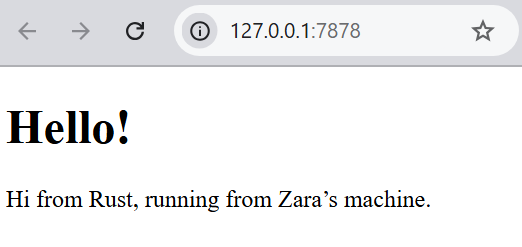
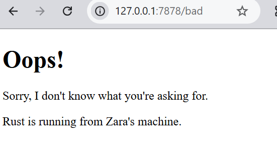

## Commit 1 Reflection Notes

Pada percobaan ini, saya mempelajari bagaimana browser mengirim HTTP request ke server.

Ketika saya mengakses http://127.0.0.1:7878, browser mengirim request seperti:
- Method (GET)
- Path (/)
- Header seperti Host dan User-Agent

Fungsi handle_connection digunakan untuk membaca request dari browser menggunakan BufReader.
Request dibaca per baris sampai menemukan baris kosong, lalu disimpan dalam vector dan dicetak.

Dari sini saya memahami bahwa komunikasi antara browser dan server menggunakan format HTTP request.

## Commit 2 Reflection Notes

Pada tahap ini, saya mempelajari bagaimana server mengirimkan response ke browser dalam bentuk HTML.
Ketika browser mengakses http://127.0.0.1:7878, server akan membaca file HTML
dan mengirimkannya sebagai HTTP response.
Fungsi handle_connection sekarang tidak hanya membaca request, tetapi juga
membuat response HTTP yang terdiri dari status line, header, dan body (HTML).

## Commit 3 Reflection Notes

Pada tahap ini, saya mempelajari bagaimana server dapat membedakan request yang
masuk dan memberikan response yang sesuai. Server kini mengecek baris pertama dari
HTTP request untuk menentukan path yang diminta. Jika request adalah GET / HTTP/1.1,
maka server mengembalikan hello.html dengan status 200 OK, sedangkan request lainnya
(seperti /bad) akan mendapatkan 404.html dengan status 404 NOT FOUND. Selain itu,
dilakukan refactoring pada fungsi handle_connection untuk menghindari duplikasi ketika menulis dua blok if-else yang masing-masing membangun response secara terpisah.
Refactoring ini penting karena membuat kode lebih ringkas, mudah dibaca, dan lebih mudah diubah di masa depan tanpa risiko inkonsistensi.

## Commit 4 Reflection Notes
Pada tahap ini, saya mempelajari bagaimana server yang berjalan secara single-threaded
menangani beberapa request dari client.
Dibuat sebuah endpoint `/sleep` yang akan membuat server menunggu selama 10 detik
menggunakan thread::sleep sebelum memberikan response. Endpoint ini digunakan untuk
mensimulasikan request yang lambat.
Saya mengamati bahwa browser ikut menunggu hingga proses pada `/sleep` selesai.
Hal ini terjadi karena server hanya menggunakan satu thread, sehingga request diproses
secara berurutan (blocking), bukan secara paralel.
Akibatnya, ketika ada satu request yang membutuhkan waktu lama, request lain harus
menunggu hingga request tersebut selesai diproses. Hal ini menunjukkan bahwa pendekatan
single-threaded tidak efisien untuk menangani banyak client secara bersamaan.

## Commit 5 Reflection Notes
Pada tahap ini, saya mempelajari bagaimana mengubah single-threaded server menjadi multithreaded menggunakan ThreadPool. Sebelumnya, setiap request diproses secara berurutan sehingga jika satu request lambat seperti /sleep, request lain harus menunggu hingga selesai. Dengan ThreadPool, sejumlah thread disiapkan di awal sebanyak 4 thread, dan setiap request yang masuk langsung didelegasikan ke thread yang tersedia melalui mekanisme channel mpsc. ThreadPool menggunakan Arc<Mutex<Receiver>> agar receiver channel dapat di-share secara aman antar banyak thread, di mana Arc bertugas untuk shared ownership dan Mutex memastikan hanya satu thread yang mengambil job dalam satu waktu. Selain itu, implementasi Drop pada ThreadPool memastikan semua worker thread selesai dengan bersih saat server dimatikan, sehingga tidak ada job yang terpotong di tengah eksekusi.